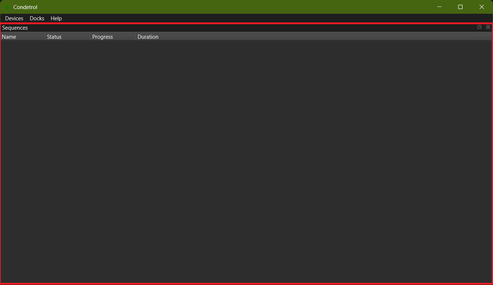
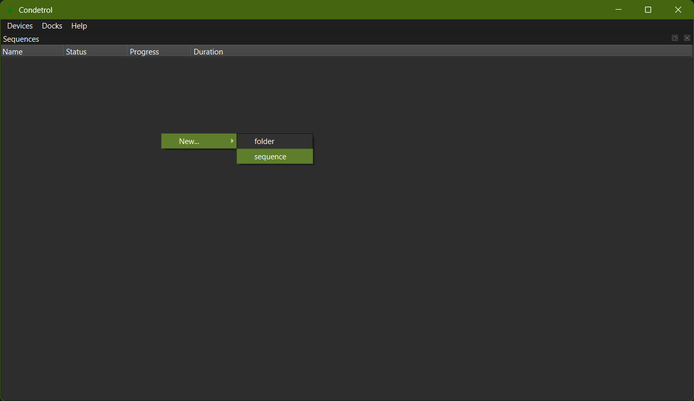
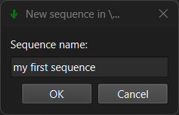
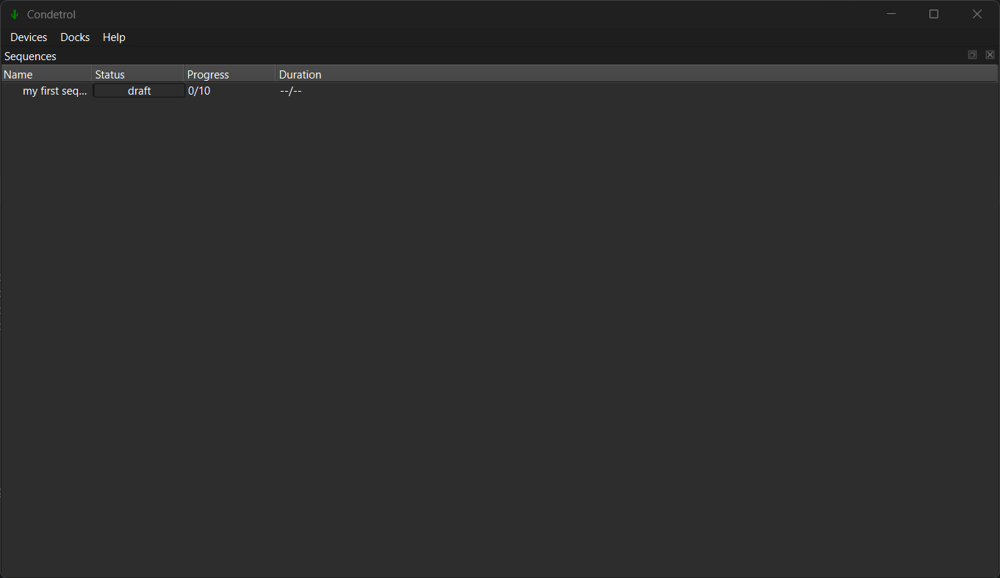
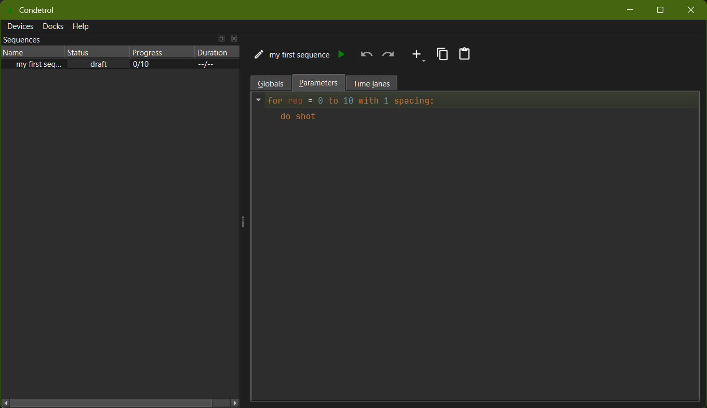

First sequence
==============

In this section, we will see how to create a first experimental sequence that controls a digital output and an analog
output.

After the previous section, you should have been able to launch the *Condetrol* application.
The *sequences* dock contains the list of experimental runs that have been launched on the experiment.
So far it is empty.

    Sequences dock

Let's create a first sequence by right-clicking inside the sequences dock and selecting *New sequence*.

    Creating first sequence

You'll be prompted to choose a new for the sequence:

    Sequence name

You can choose any name you want.
If you include the character `\\` in the name, it will be interpreted as a folder separator.
After this, you should see the sequence in the list of sequences.

    First sequence created

You can open the sequence by double-clicking on it.
This will open a new window where you can define the sequence.
The sequence window contains three tabs.
The most important ones are the *Shot* tab that defines how a single realization of the experiment is performed, and
the *Iteration* tab that defines how several shots are repeated.
The *Constants* tab is used to define parameters that can be referenced in the *Shot* and *Iteration* tabs.

    Open first sequence

When a sequence is created from scratch, it is initially set up to loop over the variable `rep` and to repeat the shot
10 times.