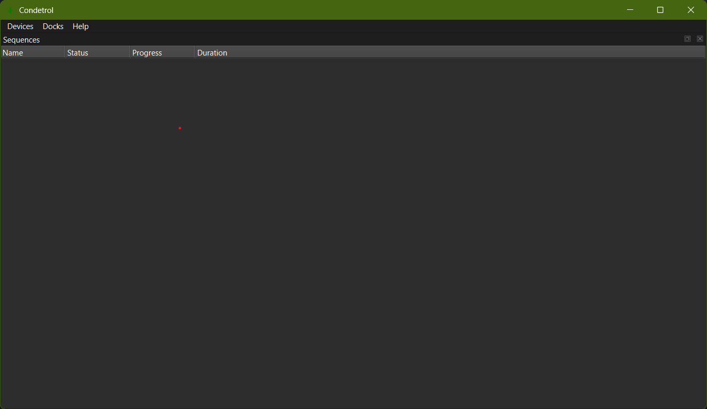

Installation
============

Installing caqtus
-----------------

You first need to install the `caqtus-suite` python package.

.. code-block:: bash

    pip install caqtus-suite

This will install the latest version of the package and its dependencies in the current python environment.
If you decide to use caqtus in the long run, it is advised to create a virtual environment for the project to avoid
conflicts with other packages, and to ensure isolation from the system python packages.
Using a package manager to do this is recommended, for example `uv`.

Configuring the experiment
--------------------------

You need to configure the experiment to tell it where to store the data.
To do so, let's create a configuration file `my_experiment_config.py` in the root of the project.

| my_experiment
| ├── my_experiment_config.py

In this file, we create a new experiment and configure it to store the data in a single file using SQLite.

.. code-block:: python

    from caqtus.extension import Experiment
    from caqtus.session.sql import SQLiteConfig

    my_experiment = Experiment(SQLiteConfig("experiment_data.db"))

This file only declares how the data should be stored, but does not create the database.
Before starting the experiment, you need to create the database by running the following command:

.. code-block:: bash

    python -c "from my_experiment_config import my_experiment; my_experiment.upgrade_database()"

This will upgrade the database to be compatible with the current version of the code.
When run for the first time, it will create the database file, such that the project folder should look like this:

| my_experiment
| ├── my_experiment_config.py
| ├── experiment_data.db

.. note::

    If you plan to acquire a lot of data (more than a few 100 MB), or want to access the database from multiple
    computers, it is recommended to use a PostgreSQL database instead of this single file sqlite database
    (see :ref:`setup-postgresql`).

You can then complete the configuration file to enable basic plugins for the experiment:

.. code-block:: python

    from caqtus.extension import Experiment
    from caqtus.session.sql import SQLiteConfig

    my_experiment = Experiment(SQLiteConfig("experiment_data.db"))
    my_experiment.setup_default_extensions()

This configures the experiment to be able to define digital and analog outputs.

You can then launch the *Condetrol* application used to define and launch experimental runs:

.. code-block:: bash

    python -c "from my_experiment_config import my_experiment; my_experiment.launch_condetrol()"

If everything goes well, you should be greeted with a window that look like this:

    Condetrol main window

